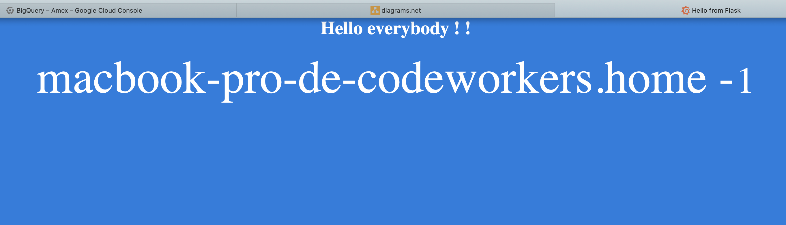
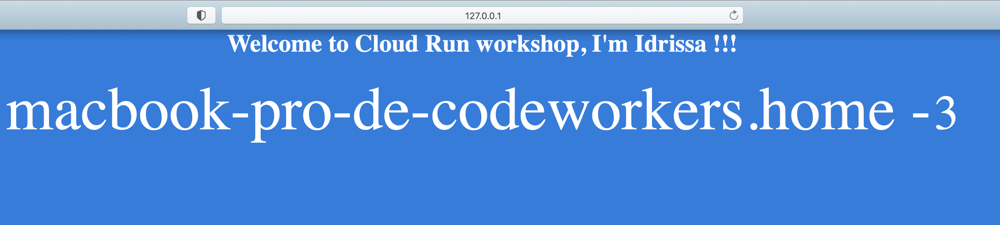
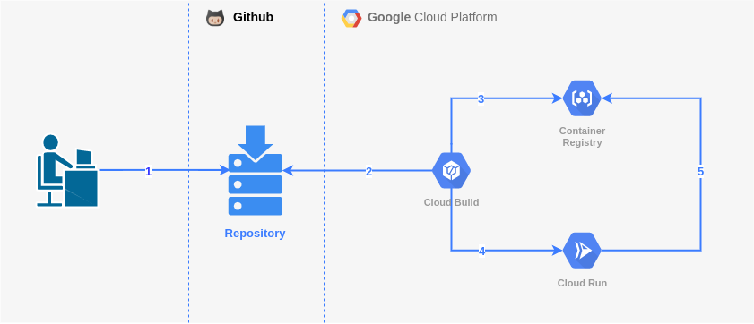

Workshop Cloud Build & Cloud Run

# Motivation
===

Workshop to get familiar with **Google Cloud Build and Cloud Run** core concepts  

1 . Build your app
===

* Install Flask

* Some screenshots !

    * Route `/hello`

        
    
    * Route `/hello/<name>`

        

* Run the app in your local machine
    
    * Go to the **cloudrun-demo** project location
        ```bash
        cd PATH_TO_YOUR_LOCAL_REPOSITORY/cloudrun-demo
        ```

    * Export FLASK_APP environment variable to tell the terminal, the application to work with
        ```bash
        export FLASK_APP=app/app.py
        ```
    * Run the Flask application
        ```bash
        flask run
        ```
    * Check url access

        ```bash
        curl http://localhost:5000/hello
        ```

2 . Architecture
===

* Screenshot

    

3 . Initialize Tooling
===

4 . Create a new GCP Project
===

* Get the project ID

    ```bash    
    # Here's an example
    PROJECT_ID=cloudrun-demo

* Get the project number (assuming the project is created above)

    ```bash
    PROJECT_NUMBER=$(gcloud projects describe $PROJECT_ID --format='value(projectNumber)')
    ```

* Link the project to the billing account

    ```bash
    gcloud alpha billing accounts projects link ${PROJECT_NUMBER} --account-id=${REPLACE_WITH_AN_ENABLED_ACCOUNT_ID}
    ```

* Inspects

    * From your terminal
        ```bash
        gcloud projects list
        ```

    * From the Google Cloud Console

5 . Init GCP configuration
===

* Configure the gcloud tool to match account / project / zone to use from scratch

    ```bash
    gcloud init
    ```

* Check all of the configuration
    ```bash
    gcloud config list
    ```

6 . Enable APIs
===

* Services available to the project to enable. This list will include any services that the project has already enabled.
    
    ```bash
    gcloud services list --available
    ```

* Enable Cloud Run Admin API

    ```bash
    gcloud services enable run.googleapis.com
    ```

* Enable Cloud Build service

    ```bash
    gcloud services enable cloudbuild.googleapis.com 
    ```
* enable Container Registry service

    ```bash
    gcloud services enable containerregistry.googleapis.com 
    ```

7 . Configure IAM permissions
====

Cloud Build requires **Cloud Run Admin** and **IAM Service Account User** permissions before it can deploy an image to Cloud Run.

- Grant the **Cloud Run Admin** role to the **Cloud Build** service account, so it will have permissions to deploy the Cloud Run service.

    ```bash
    gcloud projects add-iam-policy-binding $PROJECT_ID \
        --member=serviceAccount:$PROJECT_NUMBER@cloudbuild.gserviceaccount.com \
        --role=roles/run.admin
    ```

- Grant the **IAM Service Account User** role to the **Cloud Build** service account for the Cloud Run runtime service account. So the Cloud Run service may be configured to allow access from unauthenticated users.

    ```bash
    gcloud iam service-accounts add-iam-policy-binding \
        $PROJECT_NUMBER-compute@developer.gserviceaccount.com \
        --member=serviceAccount:$PROJECT_NUMBER@cloudbuild.gserviceaccount.com \
        --role=roles/iam.serviceAccountUser
    ```

8 . Cloud Build Configuration
====

* Open the **cloudbuild.yaml** manifest file located in the root of the project

* What do you think ? 

* Rename this variable **_SERVICE_NAME** in the manifest file like this :
    
    ```bash
    cloudrun-demo-<FIRSTNAME-LASTNAME>-service
    ```

9 . Setup the Cloud Build Trigger
===

* Use the GCP web-based Console

* Choose Push to a branch

* Connect your Github Repository

* Choose cloudrun-demo project

* Choose only your own branch to be triggered

* Choose the Cloud Build Configuration as Build configuration

* Click CREATE button

10 . Trigger builds
===
* Create a new Git branch with your name

* Commit your local changes

* Push your new branch

11 . Check the GCP Console
===

* Cloud Container Registry

* Cloud Build 

* Cloud Run

12 . Access the deployed application
===

* Pick the URL from the Cloud Run Console

13 . Clean-up all resources
===

* Delete the deployed Cloud Run service
    
    ```bash
    gcloud beta run services list
    
    gcloud beta run services delete SERVICE_NAME
    ```

* Delete the Container Registry saved images

    ```bash
    gcloud container images list

    gcloud container images delete IMAGE_NAME
    ```

* Delete the Cloud Build configured triggers


* Disconnect any connected repositories

* Delete your project using its project ID or project number

    ```bash
    gcloud projects delete $PROJECT_ID
    ```