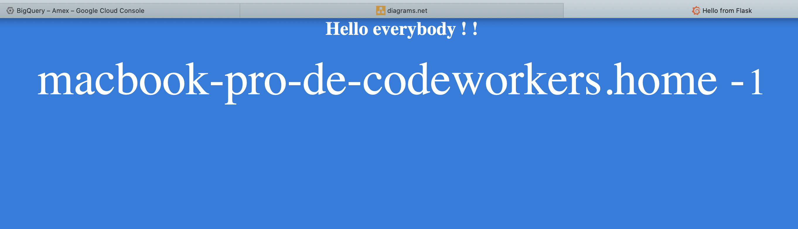

Workshop Cloud Build & Cloud Run

# Motivation
===

Workshop to get familiar with **Google Cloud Build and Cloud Run** core concepts  

1 . Build your app
===

* Install Flask

* Some screenshots !

    * Route `/hello`

        
    
    * Route `/hello/<name>`

        

* Run the app in your local machine
    
    * Go to the **cloudrun-demo** project location
        ```bash
        cd PATH_TO_YOUR_LOCAL_REPOSITORY/cloudrun-demo
        ```

    * Export FLASK_APP environment variable to tell the terminal, the application to work with
        ```bash
        export FLASK_APP=app/app.py
        ```
    * Run the Flask application
        ```bash
        flask run
        ```
    * Check url access

        ```bash
        curl http://localhost:5000/hello
        ```

2 . Architecture
===

* Screenshot

    

4 . Build
===

* Set the project ID

    ```bash    
    docker build --tag cloudrun-demo-service .
    ````

4 . Deploy
===

* Set the project ID

    ```bash    
    export GOOGLE_CLOUD_PROJECT=<PROJECT_ID>
    ```
* Submit a build using Cloud Build

    ```bash    
    gcloud builds submit --tag gcr.io/${GOOGLE_CLOUD_PROJECT}/cloudrun-demo-service
    ```
* Deploy to Cloud Run

    ```bash    
    gcloud run deploy cloudrun-demo-service --image gcr.io/${GOOGLE_CLOUD_PROJECT}/cloudrun-demo-service
    ```